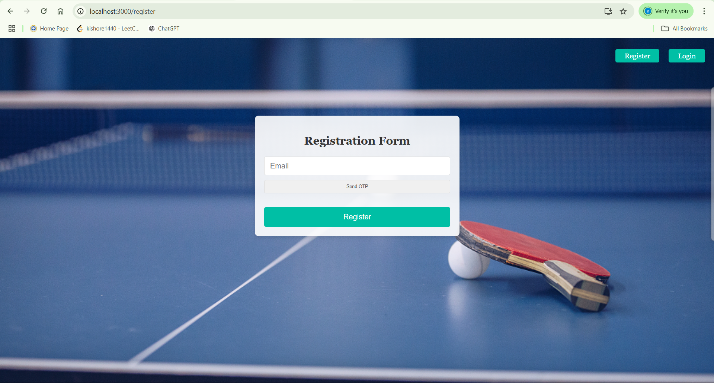
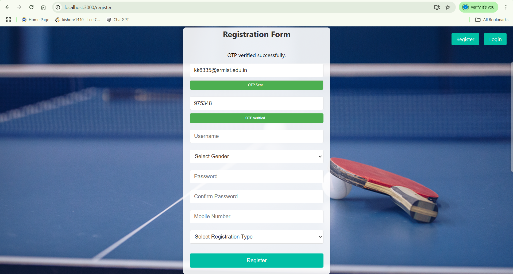
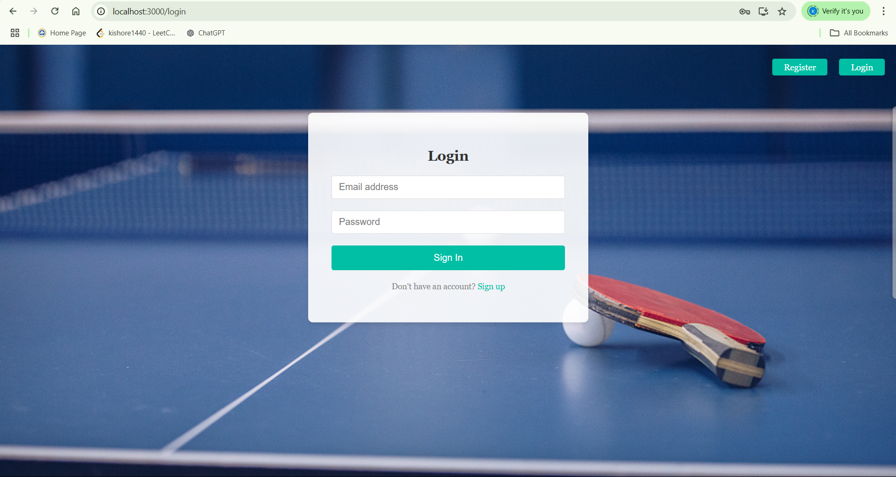
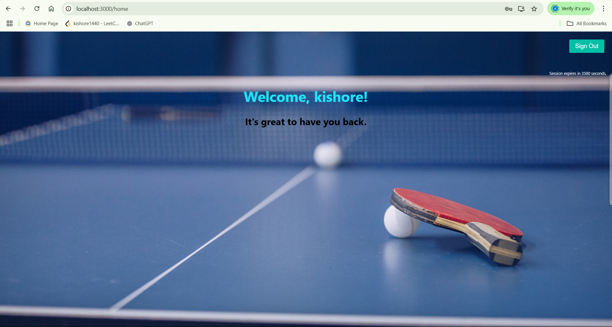

# User Registration and Login Application - Frontend Repository

Welcome to the frontend repository of the **User Registration and Login Application** developed for **TT Academy**. This application offers a seamless registration and login experience, tailored for real-time use by participants with roles such as **Player** and **Parent**. The frontend is built using **React.js**, integrated with RESTful APIs to facilitate real-time operations.

## Features
- **Dynamic Forms**: React-based dynamic forms to handle user input types and state management.
- **OTP-Based Email Verification**: Enhancing security through one-time password verification during registration.
- **Responsive Design**: Ensures smooth user experience across devices.

## Technologies Used
- React.js
- JavaScript
- Html
- CSS

## Application Flow
Here is the step-by-step flow of the application:

1. **Home Screen**: 
   - Welcome page displaying an overview of the application.
   - Navigation options for registration and login.
   - 

2. **Register Form**: 
   - User-friendly registration form to collect user details.
   - Includes role selection (Player/Parent) and email input for OTP verification.
   - 

3. **OTP Sent**:
   - Displays a confirmation message after the OTP is sent to the registered email.
   - 

4. **Login Form**:
   - Login page with fields for email and password.
   - Option to resend OTP if verification is incomplete.
   - 

5. **Logged In**:
   - After successful login, users are directed to their dashboard.
   - Displays user-specific information based on roles.
   - 

## How to Run the Application

Follow the steps below to set up and run the frontend application locally:

1. Clone the repository:
   ```bash
   git clone https://github.com/your-repo-url/frontend
   ```

2. Navigate to the project directory:
   ```bash
   cd frontend
   ```

3. Install dependencies:
   ```bash
   npm install
   ```

4. Start the development server:
   ```bash
   npm start
   ```

5. Open the application in your browser at:
   [http://localhost:3000](http://localhost:3000)

## Deployment
The frontend application is deployed and accessible at:
[https://academy-frontend-henna.vercel.app/](https://academy-frontend-henna.vercel.app/))

## Folder Structure
- **/screenshot**: Contains screenshots of different application screens.
  - `home.png`
  - `registerform.png`
  - `otpsent.png`
  - `loginform.png`
  - `loggedin.png`
- **src/**: Contains all React components and CSS files.
  - `components/`: React components.
  - `styles/`: CSS files for styling the application.

## Future Enhancements
- Add animations for better user interaction.
- Improve accessibility for users with disabilities.

## Contribution
Contributions are welcome! Please fork this repository and submit a pull request for any improvements.

## License
This project is licensed under the MIT License.

---

Thank you for exploring the User Registration and Login Application frontend repository! If you have any questions or feedback, feel free to reach out.
